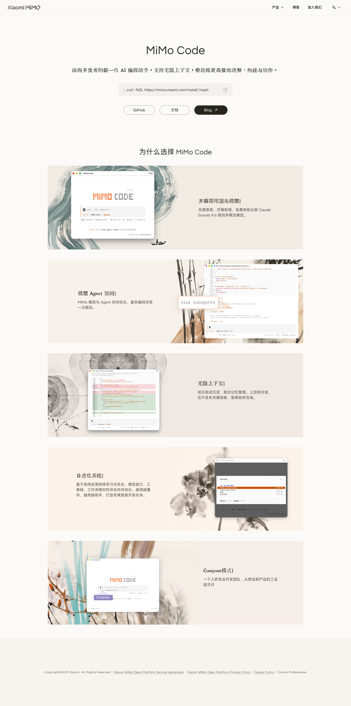

# MiMo Code Web

这是一个借助 AI 编程工具 Codex，基于 Vite、React 和 Tailwind CSS 搭建的小米 MiMo Code 官网一比一复刻项目。

官网链接：https://mimo.xiaomi.com/mimocode

项目保留了目标页面的视觉风格、本地字体和图片资源、首屏 canvas 擦除显影动效、打字机动画、复制命令交互，以及中英文切换能力。

## 网站截图



## 复刻说明

本项目借助 AI 编程工具 Codex 完成复刻开发。

对应复刻文章参考：https://mp.weixin.qq.com/s/TG9BuDzBZs-O_jyKJ-5Iyw

公众号作者：卡卡罗特AI。感兴趣可以关注一下：


## 技术栈

- Vite 8
- React 19
- Tailwind CSS 4
- Playwright

## 快速开始

安装依赖：

```bash
npm install
```

启动开发服务：

```bash
npm run dev
```

使用固定预览端口：

```bash
npm run dev -- --port 4173
```

访问：

```text
http://127.0.0.1:4173/
```

## 常用命令

```bash
npm run dev
npm run build
npm run preview
npm run test:e2e
```

## 项目结构

```text
.
├── index.html
├── public/
│   └── coder/
│       └── assets/
├── src/
│   ├── App.jsx
│   ├── components/
│   ├── hooks/
│   ├── i18n.js
│   ├── main.jsx
│   └── styles.css
├── tests/
│   └── mimocode.spec.ts
├── vite.config.js
├── playwright.config.ts
└── package.json
```

## 主要模块

- `src/App.jsx`：应用根组件，负责语言状态和链接配置。
- `src/components/`：页面组件，包括首屏、导航、按钮、功能卡片和页脚。
- `src/hooks/`：交互逻辑，包括复制命令、首屏遮罩和打字动画。
- `src/i18n.js`：中文/英文文案和功能卡片配置。
- `src/styles.css`：Tailwind 入口和复刻所需的精细 CSS。
- `public/coder/assets/`：本地镜像的字体、图片、logo 和 icon。

## 验证

提交或交付前建议运行：

```bash
npm run test:e2e
npm run build
```

当前 e2e 覆盖：

- 中文首屏渲染
- 本地视觉资源加载
- 安装命令复制
- 中英文切换

## 开发约定

- 新功能优先使用 React 组件和 hooks 实现。
- Tailwind 可用于新增布局和工具类样式。
- 像素级复刻、字体、伪元素、复杂动画和 canvas 相关样式保留在 `src/styles.css`。
- 语言文案统一维护在 `src/i18n.js`。
- 资源路径优先保持 `/coder/assets/...`，避免破坏原页面资源引用习惯。
